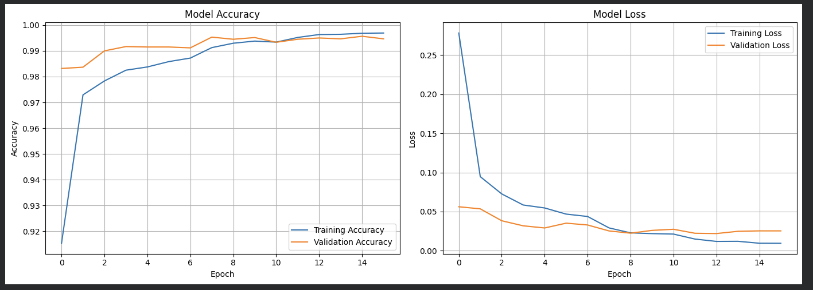
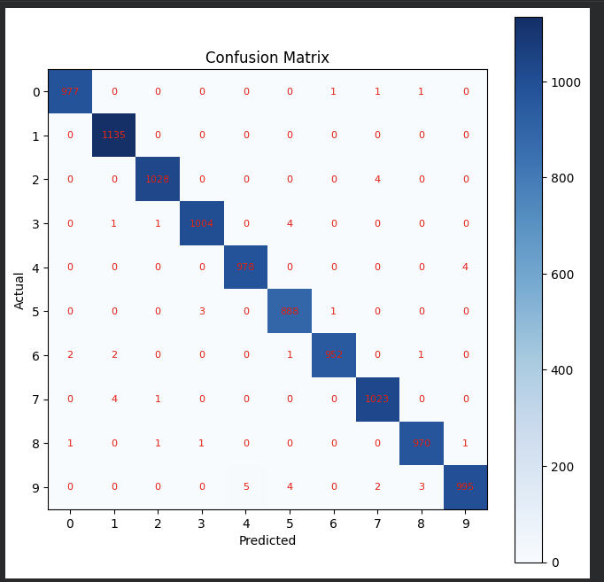
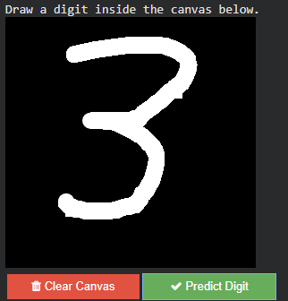
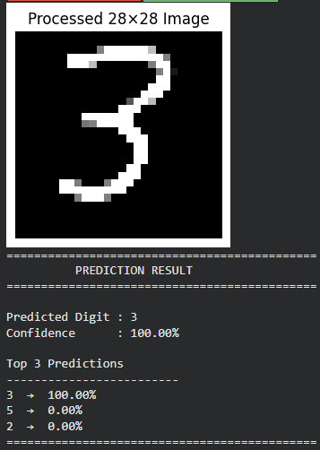

# ✍️ Interactive Handwritten Digit Recognition Using CNN

A deep learning project that recognizes handwritten digits (0–9) using a **Convolutional Neural Network (CNN)** trained on the **MNIST dataset**. The project features an interactive drawing canvas built with **ipycanvas**, allowing users to draw handwritten digits directly in Google Colab and receive real-time predictions with confidence scores.

---

## 📌 Project Overview

This project demonstrates image classification using a Convolutional Neural Network (CNN) implemented with **TensorFlow** and **Keras**. The model is trained on the MNIST handwritten digit dataset and achieves an impressive **99.55% test accuracy**.

The notebook also includes an interactive canvas where users can draw digits, preprocess them automatically, and obtain predictions along with confidence scores and the top three predicted classes.

---

## ✨ Features

- ✅ CNN-based handwritten digit recognition
- ✅ Trained on the MNIST handwritten digit dataset
- ✅ Interactive drawing canvas using ipycanvas
- ✅ Real-time digit prediction
- ✅ Confidence score for each prediction
- ✅ Top-3 predicted classes
- ✅ Training & Validation Accuracy/Loss visualization
- ✅ Confusion Matrix
- ✅ Classification Report
- ✅ Save and reload trained model using `.keras`
- ✅ Google Colab compatible

---

## 🛠 Technologies Used

- Python
- TensorFlow
- Keras
- NumPy
- Matplotlib
- OpenCV
- Pillow
- ipycanvas
- ipywidgets
- Google Colab

---

## 🧠 CNN Architecture

The implemented CNN consists of:

- Input Layer (28 × 28 × 1)
- Conv2D (32 Filters, ReLU)
- Batch Normalization
- Conv2D (32 Filters, ReLU)
- Max Pooling
- Dropout (25%)
- Conv2D (64 Filters, ReLU)
- Batch Normalization
- Conv2D (64 Filters, ReLU)
- Max Pooling
- Dropout (25%)
- Flatten Layer
- Dense Layer (256 Neurons)
- Dropout (50%)
- Output Layer (10 Neurons, Softmax)

---

## 📚 Dataset

This project uses the **MNIST Handwritten Digits Dataset**.

- **60,000** training images
- **10,000** testing images
- **10 digit classes (0–9)**
- Image Size: **28 × 28 grayscale**

---

## 📊 Model Performance

| Metric | Value |
|---------|------:|
| Training Accuracy | 99%+ |
| Validation Accuracy | 99%+ |
| **Test Accuracy** | **99.55%** |

The trained model generalizes well on unseen handwritten digits and provides highly accurate predictions.

---

## 🏆 Results

- **Test Accuracy:** **99.55%**
- Precision: **≈99%**
- Recall: **≈99%**
- F1-Score: **≈99%**
- Successfully predicts digits drawn using the interactive canvas.

---

## 📸 Screenshots

### 📈 Training Accuracy & Loss



---

### 📊 Confusion Matrix



---

### 🎨 Interactive Drawing Canvas

Users can draw handwritten digits directly inside Google Colab.



---

### 🔮 Example Prediction

The model predicts the digit along with confidence and Top-3 probabilities.



---

## 📁 Project Structure

```
Handwritten-Digit-Recognition-CNN/
│
├── Interactive_Handwritten_Digit_Recognition_Using_CNN.ipynb
├── handwritten_digit_cnn.keras
├── requirements.txt
├── README.md
└── images/
    ├── accuracy_loss.png
    ├── canvas.png
    ├── confusion_matrix.png
    └── example_prediction.png
```

---

## 📦 Requirements

- Python 3.10+
- TensorFlow
- Keras
- NumPy
- Matplotlib
- OpenCV
- Pillow
- ipycanvas
- ipywidgets

---

## 🚀 Installation

Clone the repository:

```bash
git clone https://github.com/tharakvenkat/Handwritten-Digit-Recognition-CNN.git
```

Move into the project directory:

```bash
cd Handwritten-Digit-Recognition-CNN
```

Install the required libraries:

```bash
pip install -r requirements.txt
```

---

## ▶️ How to Run

1. Open the notebook in **Google Colab**.
2. Install the required libraries.
3. Run all notebook cells.
4. Train the CNN model or load the saved model.
5. Draw a handwritten digit on the interactive canvas.
6. Run the prediction cell.
7. View the predicted digit, confidence score, and Top-3 predictions.

---

## 🔮 Future Improvements

- Deploy the model using Streamlit
- Develop a Flask/Django web application
- Support multi-digit handwritten recognition
- Improve preprocessing for handwritten paper images
- Train on EMNIST and other handwritten datasets
- Add webcam-based digit recognition

---

## 👨‍💻 Author

**Tharak Venkat**

B.Tech Computer Science Engineering  
VIT-AP University

GitHub: https://github.com/tharakvenkat

---

## ⭐ Support

If you found this project useful, please consider giving it a **⭐ Star** on GitHub.

It helps others discover the project and motivates future improvements.

---

## 📄 License

This project is intended for educational and learning purposes.
